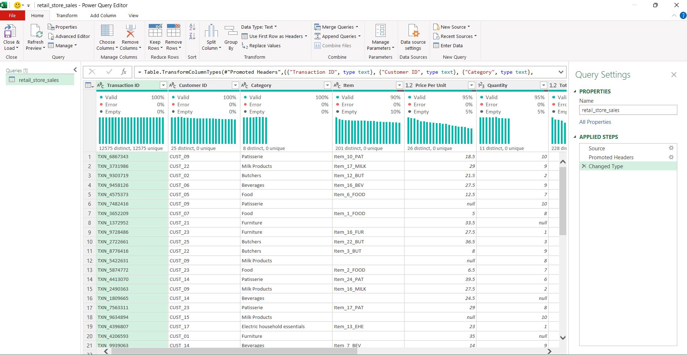
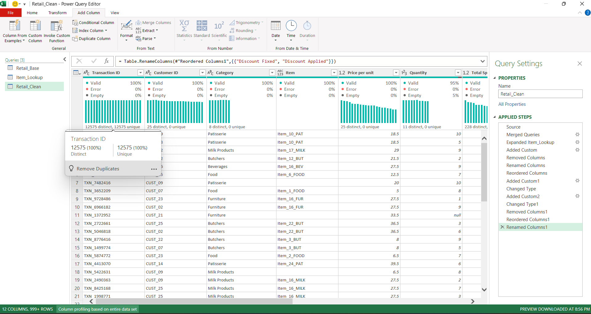
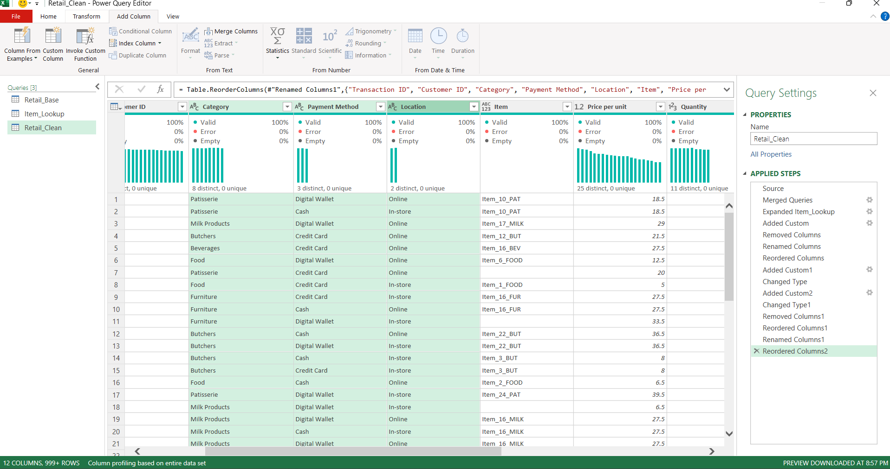
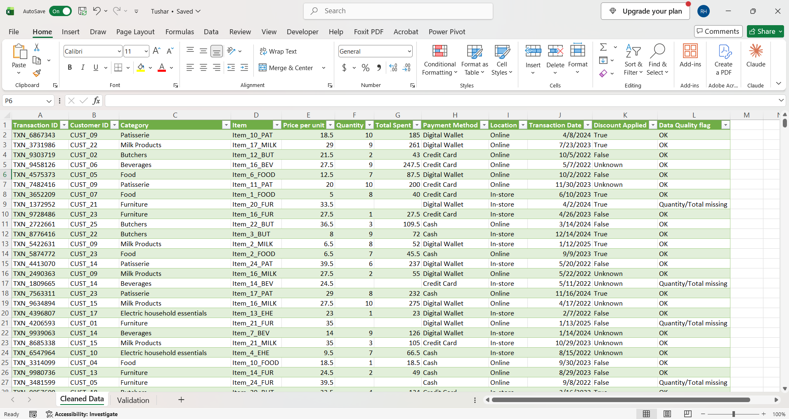

# SWYNEX Task 1: Data Cleaning & Preparation

Cleaning a raw retail sales dataset using **Microsoft Excel (Power Query and formulas)**.

**Internship:** SWYNEX Technologies
**Task:** Task 1, Data Cleaning & Preparation
*Dataset:* [Retail Store Sales: Dirty for Data Cleaning](https://www.kaggle.com/datasets/ahmedmohamed2003/retail-store-sales-dirty-for-data-cleaning) (Kaggle, by ahmedmohamed2003)

---

## 1. Project Overview

The goal was to take a raw dataset, find its data-quality problems (missing values, duplicates, incorrect data types, inconsistent values) and produce a clean, documented dataset that is ready for analysis.

Every number in this README comes from inspecting the raw file and from validation checks run on the cleaned file.

## 2. Dataset

| Property | Value |
|---|---|
| Source | Kaggle: *Retail Store Sales: Dirty for Data Cleaning* |
| File | `retail_store_sales.csv` |
| Size | 12,575 rows × 11 columns |
| Date range | 2022-01-01 to 2025-01-18 |

**Columns:** Transaction ID, Customer ID, Category, Item, Price Per Unit, Quantity, Total Spent, Payment Method, Location, Transaction Date, Discount Applied.

## 3. Data-Quality Findings (Raw Data)

4,996 of the 12,575 rows contained at least one blank value.

| Column | Problem | Count |
|---|---|---|
| Item | Missing values | 1,213 |
| Price Per Unit | Missing values | 609 |
| Quantity | Missing values | 604 |
| Total Spent | Missing values | 604 |
| Discount Applied | Missing values | 4,199 |
| Quantity | Stored as decimal (e.g. 10.0) instead of whole number | all rows |
| Transaction Date | Stored as text | 12,575 |
| Discount Applied | Boolean column containing blanks | 4,199 blank |
| All columns | Duplicate records | **0 found** |
| Category, Payment Method, Location | Inconsistent spelling, casing or spacing | **0 found** |

**Also checked and found clean:** all Transaction IDs are unique (12,575 distinct); no negative or zero prices, quantities or totals; dates are in one consistent format; in all rows where Price, Quantity and Total were all present, `Total Spent = Price Per Unit × Quantity`.

## 4. Cleaning Approach

**Principle: recover a value only when the data proves it. Otherwise flag it. Never invent it.**

| Issue | Action | Why |
|---|---|---|
| Price Per Unit missing (609) | Calculated as `Total Spent ÷ Quantity` | Total = Price × Quantity held in every complete row, so the price can be derived exactly. |
| Item missing (1,213) | Filled by looking up the item that matches the row's **Category + Price Per Unit** | Each of the 200 Category + Price combinations maps to exactly one Item. |
| Quantity and Total Spent missing (604 rows) | **Kept the rows, left the values blank, added `Data_Quality_Flag`** | Only the price is known, so any quantity from 1 to 10 fits. Filling would create fake sales, and deleting would lose 604 valid transactions. |
| Discount Applied blank (4,199) | Filled with `Unknown` | Nothing in the data shows whether a discount applied. Total is the same either way, so filling FALSE would be an assumption. |
| Quantity decimal | Converted to whole number | Quantity is a count. |
| Transaction Date text | Converted to Date | Enables date sorting and filtering. |
| Discount Applied boolean with gaps | Converted to Text (True / False / Unknown) | Allows the "Unknown" category. |
| New column | Added `Data_Quality_Flag` (`OK` or `Quantity/Total missing`) | Lets analysts exclude the 604 incomplete rows from revenue calculations. |
| Row order | Restored to the original CSV order using a temporary index column, then removed it | The merge step reorders rows. |

## 5. Tools & Steps

**Tools:** Microsoft Excel, Power Query (Get & Transform) and Excel formulas (COUNTBLANK, COUNTIF, COUNT, SUMPRODUCT, SUM).

1. Imported the CSV with **Data → From Text/CSV → Transform Data** (raw file unchanged).
2. Profiled every column with Column quality / Column distribution (based on the entire data set).
3. Set the correct data types.
4. Fixed Price Per Unit with a custom column.
5. Built an `Item_Lookup` query (200 unique Category + Price → Item rows) and merged it into the main query to fill Item.
6. Added `Data_Quality_Flag` and filled Discount Applied blanks with `Unknown`.
7. Restored the original row order, then loaded the result to Excel.
8. Built a `Validation` sheet with formulas to prove the result.

## 6. Results

- **12,575 rows retained.** No rows were deleted, and no duplicates were found.
- **12 columns** in the cleaned file (11 original + `Data_Quality_Flag`).

### Validation checks

| Check | Result |
|---|---|
| Total rows | 12,575 |
| Blank Item | 0 |
| Blank Price Per Unit | 0 |
| Blank Quantity | 604 (flagged) |
| Blank Total Spent | 604 (flagged) |
| Valid dates | 12,575 |
| Discount Applied: Unknown / True / False | 4,199 / 4,219 / 4,157 |
| Rows flagged `OK` | 11,971 |
| Rows where Price × Quantity ≠ Total | 0 |
| Sum of Total Spent | 1,552,071 |

The zero mismatches between Price × Quantity and Total show that the calculated prices agree with every total in the file.

### Evidence screenshots

| Missing values | Duplicates |
|---|---|
|  |  |

| Inconsistent values | Final cleaned data |
|---|---|
|  |  |

Also included: `Screenshots/validation_checks.png` and `Screenshots/power_query_steps.png`.

## 7. Limitations

- **604 rows have no Quantity or Total Spent.** They are flagged, not filled. Filter `Data_Quality_Flag = OK` for revenue analysis. The Total Spent sum above covers the 11,971 complete rows only.
- **4,199 rows have Discount Applied = Unknown.** Any discount analysis should treat Unknown as its own group.
- The Item recovery relies on the Category + Price → Item pattern observed in this dataset. It is not a general rule.
- In the cleaned workbook, the header `Price Per Unit` appears as `Price per unit`.

## 8. Repository Structure

```
SWYNEX-Data-Cleaning-Preparation
├── Raw Data
│   └── retail_store_sales.csv
├── Cleaned_Data
│   └── cleaned_retail_store_sales.xlsx
├── Screenshots
│   ├── missing_values.png
│   ├── duplicates.png
│   ├── inconsistent_values.png
│   ├── final_cleaning.png
│   ├── validation_checks.png
│   └── power_query_steps.png
└── README.md
```

The workbook `cleaned_retail_store_sales.xlsx` contains three sheets: **Cleaned Data**, **Cleaning Summary** and **Validation**.

## 9. What I Learned

- Profile the data before touching it. The counts drive every cleaning decision.
- Fix a value only when the data proves it, and flag the rest.
- Check the result with formulas and against the raw file, not just by eye.
- Merges can reorder rows, so keep an index column when order matters.

---

*Prepared as part of the SWYNEX Technologies internship, Task 1.* #SWYNEX
